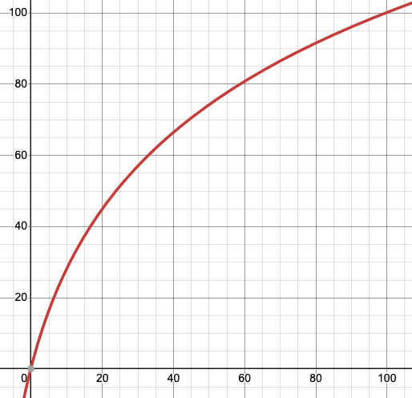

basic-cpu-mem
=============

Nothing interesting here. Run and curl to get cpu/mem usage in percent.

Prerequisite

```
pip install psutil
```

Run directly

```
./serve.py
```

Run using Docker

```
docker run -d -p 80:80 -v /proc/:/host/proc:ro ghcr.io/n-arno/basic-cpu-mem:latest
```

Run in Kubernetes

```
kubectl apply -f pod.yaml
```

Curl example

```
curl -s http://localhost:80 | jq
{
  "cpu": 7.19,
  "mem": 56.0
}
```

The "curve" function
--------------------

Variations when cpu is idle are small. To get more "colorful" values, a "correction" is done to the cpu value.

The "curve" look like this:


